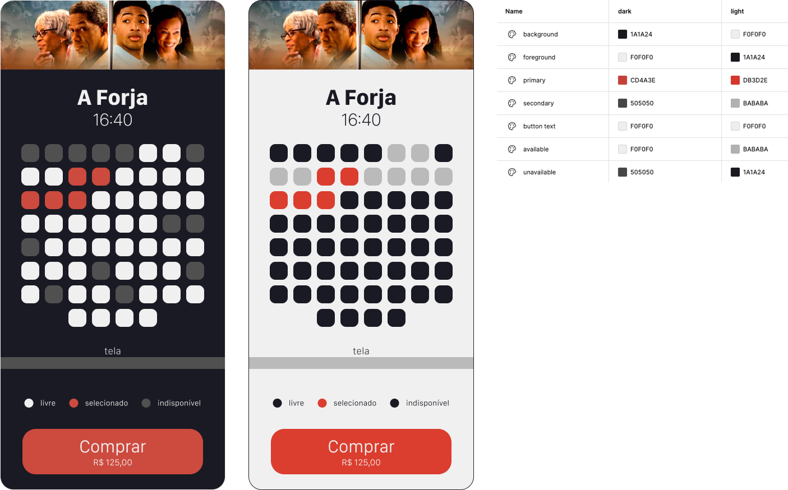

# Oficina de Swift - WTT 25

Workshop de introdução ao desenvolvimento iOS, promovido pela Apple Developer Academy | Mackenzie para alunos da universidade

## 🎬🍿 CineMack

- **Descrição**: Aplicativo para simular escolha de assento em cinema
- **Tecnologias**: Swift, SwiftUI
- **Principais Funcionalidades**: visualizar assentos disponíveis, selecionar assentos e verificar o total da conta.
- **Conteúdo**
  - Criação de interface com SwiftUI (elementos básicos)
  - Estilização de componentes (cores, estilo da fonte, peso da fonte)
  - Estado (manipulação de estado)
  - Se der tempo: ForEach para criar telas dinamicamente e Binding para passagem de valor entre componentes

## Protótipo

